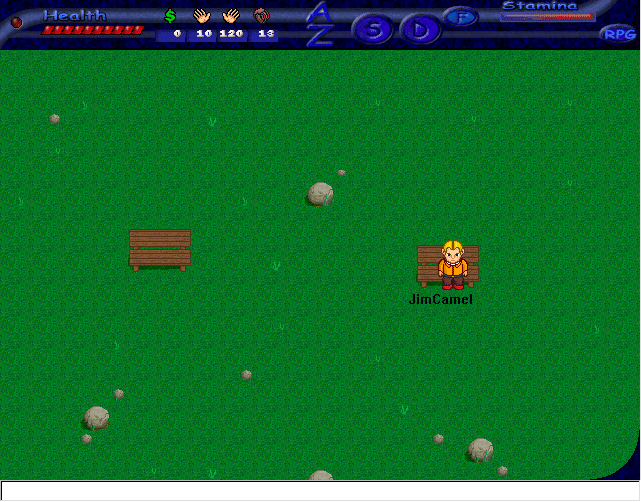



## RPG game, Version 2

### Description

This is the source code for a very early version of a MMORPG I'm writing Aeonlegend (www.aeonlegendonline.com).

It has a few features such as:

-Loading from GIF files

-Transparency in both 16 and 32 bit colour

-Easy character and GUI editing

You can make your own skins for the game by editing TOP.GIF, GUI.GIF and GUI.map.

Please remember to comment and vote for this code. The more good feedback I get, the faster the game will get made.

Note that my actual email is jimcamel@aeonlegendonline.com, the email in the text file is wrong.

If you're looking for my old code I removed it, because some people were unable to read that the graphics were borrowed.
 
### More Info
 

             |
---                |---
**Submitted On**   |2001-02-08 23:00:26
**By**             |[JimCamel](https://github.com/Planet-Source-Code/PSCIndex/blob/master/ByAuthor/jimcamel.md)
**Level**          |Intermediate
**User Rating**    |4.6 (32 globes from 7 users)
**Compatibility**  |VB 6\.0
**Category**       |[Games](https://github.com/Planet-Source-Code/PSCIndex/blob/master/ByCategory/games__1-38.md)
**World**          |[Visual Basic](https://github.com/Planet-Source-Code/PSCIndex/blob/master/ByWorld/visual-basic.md)
**Archive File**   |[CODE\_UPLOAD14675282001\.zip](https://github.com/Planet-Source-Code/jimcamel-rpg-game-version-2__1-15110/archive/master.zip)

